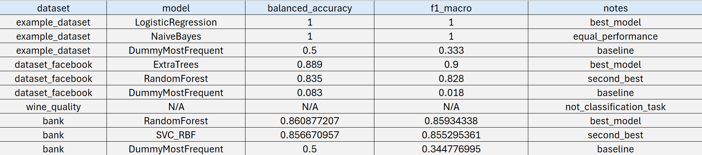

# Design and Evaluation of an Offline Agentic Data Scientist for Adaptive Classification Workflows

## 1. Introduction

This report presents the design, implementation, and evaluation of an offline Agentic Data Scientist developed for the CE888 Data Science and Decision Making coursework. The objective of this project is not simply to construct a traditional machine learning pipeline, but to design a system capable of autonomous reasoning when handling unseen datasets. In this context, autonomy refers to the ability of the system to analyse data, extract meaningful signals, construct an appropriate execution plan, select modelling strategies based on conditions, evaluate its own outputs, and adapt its behaviour when performance is insufficient. In conclusion, the approach in this project focuses more on decision making and behavior as opposed to predictive accuracy alone.

The conventional method of building ML models always follows the same predetermined process, irrespective of what data is being analyzed. Although such a pipeline performs well within a well-controlled environment, it is highly inflexible and fails to perform efficiently where new kinds of datasets are involved. In contrast, this project employs an agent-based structure where behavior becomes dynamic depending on the nature of the dataset. This shift from static pipelines to adaptive systems is the key motivation behind the concept of an agentic data scientist.
The developed system transforms the existing coursework framework into a modular structure comprising four major elements: planner, executor, reflector, and memory. Each module plays its role in creating a feedback loop based on which decisions are made taking into account not only the features of the dataset but also the outcomes of previous executions. The planner selects appropriate actions to take, while the executor performs them, the reflector measures their effectiveness, and memory saves knowledge gained from previous executions.

In order to test the system's efficiency, three datasets with distinct features have been chosen for evaluation. The example dataset represents a very small classification problem, testing the agent’s behaviour under extreme data scarcity. The WineQuality dataset introduces a scenario where the inferred target is not suitable for classification, requiring the agent to recognise and handle this condition correctly. The dataset_facebook dataset presents a more complex case with mixed feature types, high-cardinality variables, and multiclass classification. These datasets were selected not to maximise performance comparisons, but to evaluate whether the system behaves appropriately under varying conditions.

The results show that the system is able to adjust its processes according to the characteristics of the data. If the data is small, then simpler models are chosen. Invalid modeling is not done in case of inappropriate tasks, while appropriate processes for more complicated datasets are selected. This shows the need for reasoning abilities in an agentic system.

Artificial intelligence tools were used as support during this project. They were mainly used to help generate possible suggestions for the reflector component (e.g., the reflect() function) and to assist in writing test cases. They were also useful for debugging and understanding design decisions. However, all final implementation, system design, and evaluation were completed independently.

---

## 2. System Architecture (Agents, Tools, and Data Flow)

Modular architecture is used to develop the system, making all responsibilities distributed across components. Such architecture allows the system to be clear and adaptable to future needs.
At the core of the system lies the executor, represented by the AgenticDataScientist class. Executor is considered the coordinator of all actions performed during the workflow. Its responsibility consists of orchestrating such aspects of workflow like data loading, plan execution, evaluation, reflection, and results generation. Furthermore, executor manages error handling, keeps track of execution state, and controls execution flow, including retries and replanning. At the same time, executor does not take any major decisions but leaves it up to another component.

Planner component is intended to perform decision-making. The planner receives the dataset profile as an input and generates a well-defined execution plan based on that information. Plan is defined as an ordered collection of steps, specifying workflow of the specific data. In other words, the planner does not produce an actual pipeline but changes a predefined plan according to rules. Thus, if the dataset is small, then steps related to building simpler models will be added to the plan. High cardinality categorical features call for adding some pre-processing protection measures. This approach ensures that the workflow is tailored to the dataset rather than applied uniformly.

The system relies on a set of tools to perform actual data science operations. The data profiler extracts structured information about the dataset, including feature types, missing values, and class distribution. This information forms the basis for all subsequent decisions. The model generator develops preprocessing pipelines and trains various candidates as potential models. The tool is able to handle various models and behaves accordingly, depending on the features of the dataset. The evaluation tool calculates performance metrics, draws confusion matrices, and creates outputs that will later serve as an input for reflection. All these tools are independent, which makes them more adaptable.

The reflector's job is to examine the result of modelling and evaluation performed by other components. Reflectors evaluate the performance by means of different metrics and decide on whether further work is required. In case of problems, suggestions are made and the possibility of initiating replanning is determined. This way, the feedback loop is introduced into the system, as it can change its own behavior according to the obtained results.

Memory is a component that is responsible for retaining some information between the runs. Memory stores information regarding previously processed datasets – the most efficient models, along with their performance metrics. Datasets are recognized by the special fingerprint assigned to each particular object. Memory serves as an additional guide for planning, which is flexible and allows applying old methods to new situations.

The overall data flow follows a structured loop. The dataset is first loaded and profiled, producing a set of signals. These signals are passed to the planner, which generates an execution plan. The executor then applies this plan using the modelling and evaluation tools. The output of the results is processed by the reflector to determine whether any additional changes are required. If such changes are needed, the system engages in replanning. Lastly, the output of results is saved in memory for future reference. The process will continue until an optimal result is obtained or until a certain limit is met.

The above design gives structure to the entire process and yet makes it flexible at the same time. There are distinct roles played by each of the different components of the system, but it is through the interaction between these different parts where the flexible aspect comes into play.

---

## 3. Dataset Understanding (Signals and Why They Matter)
A key design principle of the system is that all decisions must be based on observable dataset properties. For this reason, the system begins every run by constructing a dataset profile that captures a set of signals describing the data. These signals are not only used for description but also directly influence planning, modelling, and evaluation.
The amount of rows dictates the size of the training data set, where the smaller the data set, the higher the probability of overfitting. The larger the data set, the greater the complexity of the model, but there are also other factors to consider. Likewise, the amount of columns affects preprocessing techniques.

Feature types are another critical signal. This method knows the difference between numeric and categorical predictors and exploits it when building proper pre-processing pipelines accordingly. For mixed data sets, complex pre-processing pipelines are needed, while for single-type data sets, there is an option of using simpler ones. Preprocessing will become redundant without it, and the results may be negative for the model.

High cardinality features are viewed as another feature group because of the effect that they have on modeling. One-hot encoding of categorical predictors with high cardinality causes a problem with dimensionality. Identifying the case at the initial stage makes it possible to use different processing options and prevent the use of unsuitable models.

Missing data is also analysed as part of the dataset profile. Rather than utilizing one specific approach, the system classifies missing values into various levels depending on their seriousness. This way, the amount of data preprocessing required can be tailored to the magnitude of missing data, and the data processing system will not either underestimate or overestimate data quality problems.
The signals from the targets define the type of tasks to be performed. The system automatically determines the target attribute, checking if the attribute can be classified or not. In case the target attribute fails the check, the whole process is shut down. This is critical since the system will not perform modeling and thus shows autonomy by knowing when to stop.

Class distribution is examined for classification purposes as an indicator of whether the data is imbalanced or not. Imbalance in the dataset may cause inaccurate results because of improper handling. For this reason, the system prefers balanced accuracy and macro F1-score to be used as a better metric for performance measurement.

Moreover, along with other signals, the system produces explanatory notes indicating significant conditions for the particular dataset. This will ensure transparency and clarify the basis of decisions.

Generally, data analysis in this system is implemented as signals with an influence on the behavior of the system.

---

## 4. Planning Logic (Conditional Decisions)
The planner serves as the reasoning engine within the framework and is tasked with transforming data set information into an organized execution plan. Contrary to conventional processes where the flow of operations is predetermined, the planner utilizes conditional rules to formulate the flow of operations on-the-go.

The planning activity commences by constructing a base plan, which specifies all the basic steps required for processing the data set. These include data profiling, pre-processing, model selection, training, evaluation, reflection, and reporting. It should be noted that the base plan ensures all necessary actions are performed. Nevertheless, the plan remains as generic as possible without making any assumptions about the data set characteristics. The planner then modifies this plan by inserting additional steps based on conditions derived from dataset signals.

Size of the data set is another important consideration when making planning choices. In case of a tiny data set, the planner incorporates steps which ensure that models with a lower complexity are preferred and warnings are made concerning overfitting of such data sets. This has to be done since higher model complexities have the ability to learn tiny data sets, and the results will be misleading. Larger data sets allow models with higher complexity levels. However, other factors like computational cost have to be considered.

The combination of features is another important consideration. Based on this, it selects an appropriate preprocessing strategy. Mixed datasets require combined pipelines, while purely numeric or purely categorical datasets allow more specialised handling. Upon detection of high-cardinality categorical attributes, additional measures are taken by the planner to ensure that the problem of having too many dimensions arising from encoding is avoided.

When dealing with missing data, the solution adopted by the planner uses a multilevel strategy where missing values are assessed for their importance, and appropriate actions are put in place.
The other crucial issue at hand is the nature of the work. In instances whereby the data set is inappropriate for classification, a process that stops further processing is included.
Class imbalance introduces further conditional behaviour. The planner assesses the imbalance ratio and modifies both the modelling strategy and evaluation process according to the findings. For instance, it could prefer evaluation measures that consider the imbalance problem or models that can perform class weighting.

The planner could also include knowledge from memory into the decision-making process. In particular, the planner may prefer models whose performance was good when dealing with a dataset similar to the current one. This, however, should not significantly affect the planning process.
Lastly, the planner ensures that the plan produced has no duplicates in its processes and maintains a logical sequence of activities.

---

## 5. Tool Use: Modelling and Evaluation (Metrics, Baselines)
It is up to the modelling and evaluation elements to implement the plan and achieve tangible outcomes. The flexibility of these elements, together with their awareness of data, allows handling different types of datasets.

The modelling process begins with preprocessing. The numerical variables undergo imputation and scaling procedures, whereas the categorical variables undergo one-hot encoding. Feature selection methods are used for dimensionality reduction where required, enhancing the efficiency and stability of the models. The pipeline is formed dynamically according to the characteristics of the data being processed.

Model selection is conditional rather than fixed. The system includes a baseline model (DummyClassifier), a linear model (Logistic Regression), and ensemble models such as RandomForest and ExtraTrees. Additional models may be included depending on dataset size and feature composition. For example, Support Vector Machines may be excluded when high-cardinality features are present due to their sensitivity to dimensionality.

An important design choice is the inclusion of the baseline model. The DummyClassifier provides a reference point that represents trivial performance. By comparing learned models against this baseline, the system can determine whether meaningful learning has occurred. This is an important step because of the risk of generating spurious results, especially in cases where there is an imbalance in the dataset.

As part of the training procedure, the training process involves pairing each model with the preprocessing pipeline and training it on train/test splits. If possible, this should involve using stratified sampling in order to maintain balance among classes.
Evaluation is performed using multiple metrics. While accuracy is included, it is not the primary metric. Instead, the system prioritises balanced accuracy and macro F1 score, as these provide a more reliable assessment in imbalanced or multiclass settings. Precision and recall are also computed to provide additional insight into model behaviour.
The evaluation process also generates a confusion matrix and a classification report. These outputs provide detailed information about prediction errors and class-level performance, making it easier to interpret results.

Models are ranked based on balanced accuracy and macro F1 score. The best-performing model is selected and passed to the reflection stage. This structured evaluation ensures that model selection is both consistent and aligned with dataset characteristics.

---

## 6. Experiments and Results

The system was evaluated on four datasets to assess its behaviour under different conditions. The focus of these experiments is not only performance, but also whether the system adapts its behaviour correctly.
 

Figure 1 The comparison of all candidate models across the evaluated datasets.

The analysis of the findings presented in Figure 1 demonstrates how effectively the models can be compared to each other on all datasets and how effective decision making by the agent is.
For example, for the dataset named example_dataset.csv, one may notice that Logistic Regression and Naïve Bayes have demonstrated the highest macro F1-scores equal to 1.0, whereas the DummyMostFrequent model has been considerably less accurate with its F1-score being equal to only 0.333. Thus, one may see that even very simple models could detect patterns within the data set and make predictions about classes, but at the same time, the similar efficiency of Logistic Regression and Naïve Bayes models together with a very small size of the dataset suggests that the models are overfitting the data rather than generalising it. Consequently, the decision of the planner to limit model space to the simpler models was reasonable.

For the WineQuality.csv example, however, it is correctly recognised that there is no target suitable for classification. This is evident from Figure 1, where we can see that no models are evaluated and evaluation ends prematurely. It is crucial to highlight this feature since it shows that the agent is able to understand that some tasks cannot be solved by the algorithm used for modelling. Rather than forcing a certain type of pipeline, invalid outputs are prevented, indicating advanced reasoning compared to standard pipelines.

On the other hand, the dataset_facebook.xlsx example offers a more challenging situation, and we find out that there is a distinct superiority chain among the models. Specifically, the ExtraTrees model scored the highest in the metrics of macro F1 (0.900) and balanced accuracy (0.889), surpassing both RandomForest (F1 = 0.828) and leaving the DummyMostFrequent baseline (F1 = 0.018) way behind. Given the big difference in the metric scores between the baseline and learned models, we can state that the current data set is full of interesting regularities that can be discovered through a proper algorithm.

Comparing RandomForest and ExtraTrees models also highlights the differences in model behavior. Even though both models follow an ensemble approach, ExtraTrees model outperforms the other slightly because of its additional randomness that may help in generalization in high dimensional categorical data. This finding also supports the choice made by the planner on preferring tree-based models when there are high cardinality categorical variables.

Another experiment was conducted on the bank.csv dataset, where the task involved a more complicated binary classification problem with mixed types of features and relatively balanced classes. The correct target variable (deposit) was detected by the agent, and the modelling process proceeded successfully. As can be seen from Figure 1, the best performing algorithm was RandomForest with balanced accuracy and macro F1 of 0.861 and 0.859 respectively, surpassing other algorithms by a wide margin. The second best performer was the SVC algorithm with similar performance metrics, while ExtraTrees and LogisticRegression had moderate performance levels. The DummyMostFrequent model was once again noticeably worse with F1 score of only 0.345, confirming the presence of patterns that can be exploited by the other models. While the rather small difference between RandomForest and SVC implies the possibility of using other models to solve the problem, the variation in performance across models suggests some sensitivity to the choice of algorithm. Overall, good performance metrics in relation to the baseline imply successful agent operations. This experiment further validates the adaptability of the system, as it correctly handled a larger and more complex dataset, selected suitable models, and produced stable and high-quality results.

In all datasets, comparing the baseline model is very enlightening. In both classification datasets, the baseline model performs poorly, confirming that the selected models are not simply exploiting class distribution but are learning meaningful relationships within the data. This validates the effectiveness of the agent’s model selection strategy and supports the claim that the system performs more than a predefined pipeline execution.

Overall, the experimental results demonstrate that the agent adapts its behaviour according to dataset characteristics. It makes modeling easier for smaller datasets, prevents any incorrect processing when the task is not appropriate, and allows better modeling when the input data is complicated. Perhaps more importantly, the relationship between the signal from the data, decision-making in planning, and outcome in model selection suggests coherence in the system.

---

## 7. Reflection and Re-Planning
The reflection component introduces a feedback mechanism that allows the system to evaluate its own performance and adjust its behaviour. Instead of relying on a single execution, the system analyses results and determines whether improvements are needed.

The reflection process begins by evaluating the best model using multiple metrics, including balanced accuracy and macro F1 score. Based on these metrics, the system assigns a qualitative status such as “poor”, “average”, or “good”. This simplifies decision-making while maintaining a connection to quantitative results.

The system then identifies potential issues. These may range from poor performance, imbalance effect, ineffective improvement on the baseline model, and model instability. The problems mentioned above are coupled with recommendations for how to improve them, such as extending the set of models and altering the pre-processing step.

Replanning is performed either when performance is not adequate or if there are certain problems found. Rather than creating a new plan, the plan is altered incrementally to ensure efficiency.
There is a restriction placed on the number of times replanning can be done to avoid an endless cycle of adjustments.
In summary, reflection and replanning change the nature of the pipeline by making it capable of self-improvement.

---

## 8. Memory & Learning
The memory component allows the system to retain information across runs, introducing a basic form of learning. Each dataset is represented using a fingerprint, which uniquely identifies it based on its structure.

For each dataset, the system stores metadata, the best-performing model, and associated performance metrics. Historical results are preserved rather than overwritten, allowing the system to track performance over time.

Memory is primarily used during planning. When a dataset is recognised, the planner can prioritise models that performed well previously. However, memory does not override current dataset analysis, ensuring that the system remains adaptable.
The system selects the best historical model based on performance rather than recency, ensuring effective reuse of past knowledge. Basic fault tolerance mechanisms ensure that memory remains reliable.

Although the current implementation focuses on exact matches, it can be extended to support similarity-based retrieval, allowing the system to generalise knowledge across datasets.

---

## 9. Ethics & Limitations
The system has several ethical and technical limitations. It does not perform fairness analysis, meaning that biased datasets may produce biased models. While balanced metrics mitigate some issues, deeper forms of bias are not addressed.

Transparency is limited to technical explanations, which may not be accessible to non-expert users. This could affect trust in real-world applications.

The system is restricted to classification tasks and cannot handle regression or other problem types. Its rule-based logic may not generalise perfectly across all datasets.
Model diversity is limited, and evaluation relies on a single train-test split, which may reduce reliability. Memory usage is also limited, as it relies on exact dataset matching.
Overall, the system should be considered a prototype rather than a production-ready solution.

---

## 10. Conclusion & Future Work
This project demonstrates that an agentic approach to data science can produce adaptive and interpretable behaviour. By integrating planning, execution, reflection, and memory, the system moves beyond static pipelines and enables dynamic decision-making.

The experiments show that the agent adapts effectively to different dataset conditions, selecting appropriate models and handling edge cases correctly. Besides the efficiency of the system, another strength is the alignment between the nature of the dataset and decision-making.

Further development can include adding support for new kinds of tasks, better planning by implementing adaptivity, better modeling algorithms, and improved memory systems. Better evaluation metrics and interpretability would make the system applicable in more scenarios.
In summary, the current research is a good basis for exploring the area of autonomous data science systems.
